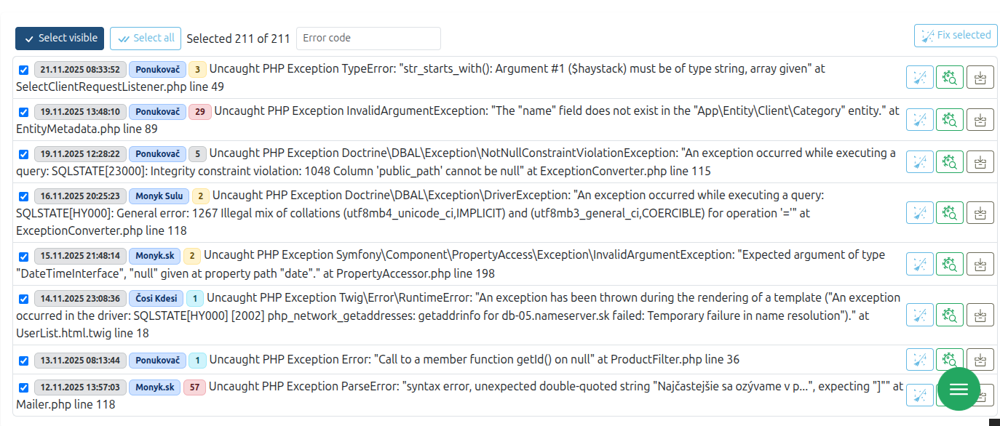

# 🛒 Batch Selection Bundle

<p align="center">
<br>
</p>

Make true "Select All" and persistent multi‑page selection effortless in Symfony. This bundle lets users select items across pagination, filters, and even page visits, then run bulk actions reliably without loading entire entities into memory.

> ⚠️ Work in progress: Public API may change. Not production‑ready yet.

---

## ✨ What you get

- Real Select All across thousands of records (beyond one page)
- Persisted selection across pages, filters, and revisits
- Memory‑safe bulk actions (ID‑only processing)
- Doctrine‑optimized loaders (Pagerfanta adapters supported)
- Flexible ID normalization (ints, strings, UUIDs, complex types)
- Modular architecture via `IdentityLoaderInterface`, `IdentifierNormalizerInterface`, and more

---

## 📌 Use cases (at a glance)

- E‑commerce: Select all products in a filtered category, uncheck a few, apply bulk discount
- Invoicing: Pick invoices across pages, then export selected to ZIP
- Media library: Infinite scroll, keep selection while organizing or deleting
- Newsletter: Select thousands of bounced emails in one action
- HR wizard: Select across steps, confirm only chosen items in the next step
- Moderation: Quickly approve/ignore across multiple pages
- CSV import: Select all failed rows, exclude a few, then discard
- Wishlist/Compare: Persist selected item IDs across browsing

---

## 🚀 Quick start

### 1) Configure the bundle

```yaml
# config/packages/batch_selection.yaml
batch_selection:
    default:
        normalizer: 'batch_selection.normalizer.object'
        identifier_path: 'id'
        storage: 'batch_selection.storage.session'
    scalar:
        normalizer: 'batch_selection.normalizer.scalar'
    array:
        normalizer: 'batch_selection.normalizer.array'
        identifier_path: 'id'
```

```yaml
# config/routes/batch_selection.yaml
batch_selection:
    resource: '@BatchSelectionBundle/config/routes.php'
```

### 2) Register a source (Doctrine QueryBuilder)

```php
<?php

final class LogList extends AbstractController
{
    public function __construct(
        private readonly RecordRepository $recordRepo,
        private readonly SelectionManagerInterface $selectionManager,
    ) {}

    public function init(): void
    {
        $qb = $this->recordRepo->createQueryBuilder('record')
            ->where('record.status like :status')
            ->andWhere('record INSTANCE OF :class')
            ->andWhere('record.project IN (:projects)')
            ->setParameter('status', $this->status . '%')
            ->setParameter('class', $keys)
            ->setParameter('projects', array_map(fn(Project $p) => $p->getId()->toBinary(), $projects))
            ->orderBy('record.date', 'DESC')
            ->setMaxResults(100);

        // Make this query the selection source identified by "main_logs"
        $this->selectionManager->registerSource('main_logs', $qb);
    }

    public function clearAll(): void
    {
        $ids = $this->selectionManager->getSelection('main_logs')->getSelectedIdentifiers();

        $ids = array_map(fn(string $hexId) => (new Uuid($hexId))->toBinary(), $ids);

        $rows = $this->recordRepo->createQueryBuilder('record')
            ->where('record.id IN (:ids)')
            ->setParameter('ids', $ids)
            ->getQuery()->getResult();

        foreach ($rows as $record) {
            $repo = $this->registry->getRepository($record::class);
            $repo->clear($record);
        }
    }
}
```

### 3) Wire up the UI (Twig + Stimulus)

```twig



    


<table {{ batch_selection_stimulus_controller('main_logs', null, {
    selectAllClass: 'btn-primary',
    unselectAllClass: 'btn-outline-secondary',
}) }}>
    <thead>
    <tr>
        <th colspan="2">
            <button
                class="btn btn-primaryoutline-secondary btn-sm text-nowrap m-1"
                data-action="{{ batch_selection_stimulus_controller_name }}#selectCurrentPage"
            >
                <twig:ux:icon name="bi:check" width="20px" height="20px"/>
                Select visible
            </button>
            <button
                class="btn btn-primaryoutline-secondary btn-sm text-nowrap m-1"
                data-action="{{ batch_selection_stimulus_controller_name }}#selectAll"
            >
                <twig:ux:icon name="bi:check-all" width="20px" height="20px"/>
                Select all
            </button>
            <span class="p-1 text-nowrap">Selected {{ batch_selection_count('main_logs') }} of {{ batch_selection_total('main_logs') }}</span>
        </th>
    </tr>
    </thead>

    <tbody>
    
        <tr>
            <td>
                {{ batch_selection_row_selector('main_logs', log, { class: 'm-1 align-bottom' }) }}
            </td>
            <td>My Row</td>
        </tr>
    
    </tbody>
</table>
```

---

## 🧠 How it works (in short)

- You register one or more selection sources (e.g., Doctrine `QueryBuilder`)
- The bundle tracks selected IDs (not full entities) in storage (session by default)
- Twig helpers and a Stimulus controller provide a minimal, fast UI to select current page or truly select all
- When executing the bulk action, you read the normalized IDs and act on them efficiently

---

## 📣 Notes

- Designed for very large datasets; easily extend loaders if you grow beyond 100k items
- Built for Symfony; integrates via DI/attributes and keeps overhead minimal
- API may evolve while the bundle is under active development
